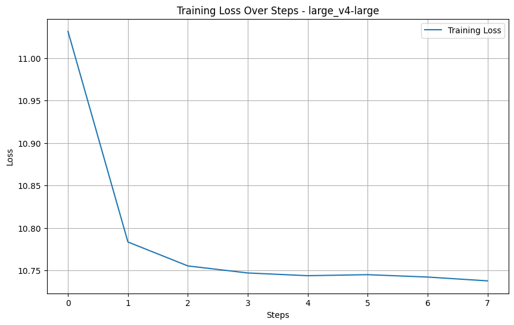
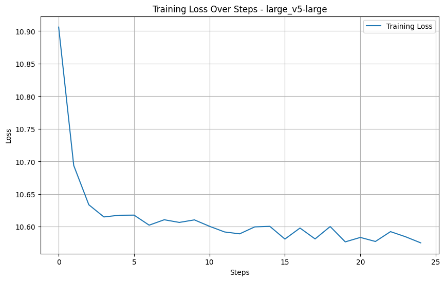
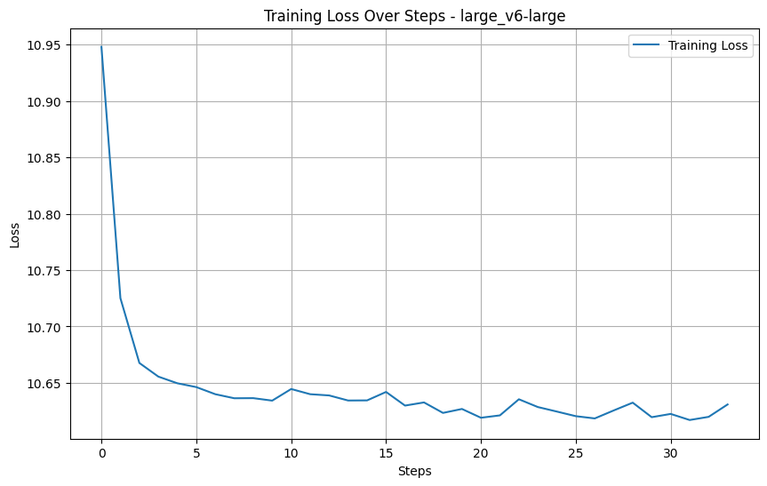
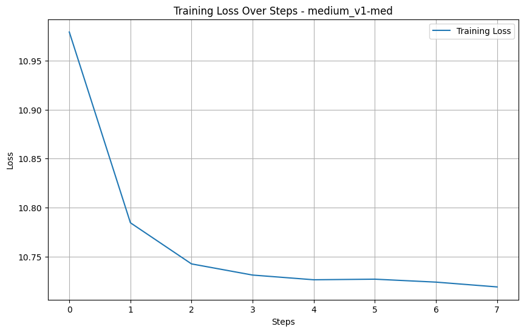
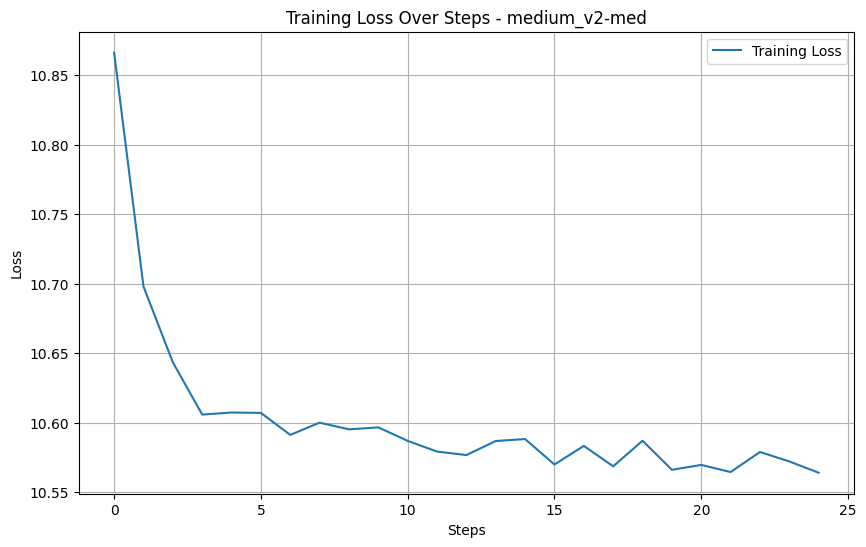
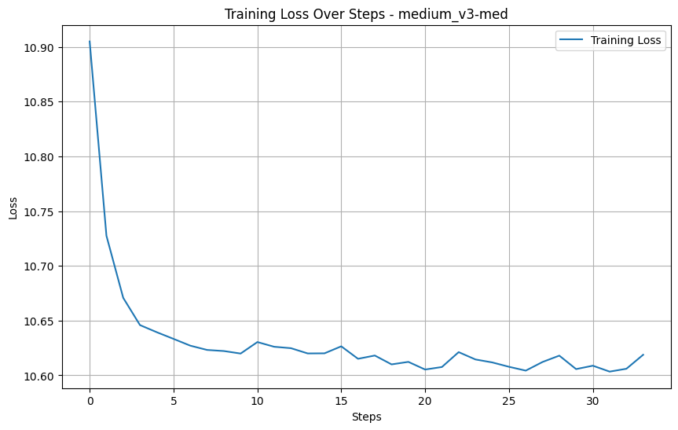

# Fine-Tuning GPT-2 for Turkish Mathematical Question Answering

## Project Overview

This project focuses on fine-tuning the Generative Pre-trained Transformer 2 (GPT-2) model for a specialized task: answering mathematical questions in the Turkish language. Two different sizes of the model, `gpt2-medium` and `gpt2-large`, were fine-tuned on a custom Turkish Question-Answering (QA) dataset related to mathematics.

The primary objective was to adapt the general-purpose language capabilities of GPT-2 to a specific domain, enabling it to generate accurate and contextually relevant answers to mathematical queries. The project tracks the training and validation loss to monitor learning performance and provides qualitative results through generated text samples.

## Dataset

The model was fine-tuned on a specialized Turkish dataset named **`turkish_qa_math`**. This dataset contains question-and-answer pairs focused on various mathematical concepts.

The data was structured into a single text format for the language modeling task, with each entry formatted as follows:

Soru: {question} Cevap: {answer}

This format helps the model learn the relationship between a question and its corresponding answer in a generative context.

## Methodology

The core methodology for fine-tuning the models is implemented in the `code/code.ipynb` notebook and follows these steps:

1.  **Model Selection**: The project experiments with two pre-trained models from the Hugging Face Hub: `gpt2-medium` and `gpt2-large`. This allows for a comparison of performance based on model size.
2.  **Data Preparation**: The `turkish_qa_math` dataset is loaded and tokenized. A `DataCollatorForLanguageModeling` is used to prepare the data batches for training, with Masked Language Modeling (MLM) disabled (`mlm=False`) as this is a causal language model.
3.  **Fine-Tuning**: The Hugging Face `Trainer` and `TrainingArguments` classes are used to configure and execute the fine-tuning process. The models are trained to minimize the causal language modeling loss on the provided dataset.
4.  **Evaluation**: The model's learning progress is evaluated by tracking the training and validation loss across epochs. The final performance is assessed qualitatively by providing the fine-tuned model with new mathematical questions and observing the generated answers.

## Code and File Structure

The project repository is organized as follows:

- **/code/**: Contains the main Jupyter Notebook for the project.
  - `code.ipynb`: The notebook with the complete code for data loading, model fine-tuning, and inference.
- **/loss/**: Contains plots visualizing the training and validation loss for different model experiments.
- **/outputs/**: Contains text files with sample outputs generated by the fine-tuned models.
  - `outputs.docx` / `outputs_cleaned.txt`: Examples of questions posed to the model and the corresponding generated answers.

## How to Run

1.  **Environment Setup**: A Python environment with a GPU is highly recommended for efficient model training.
2.  **Install Dependencies**:
    ```bash
    pip install transformers datasets torch
    ```
3.  **Execute the Notebook**: Open and run the `code/code.ipynb` notebook. You can modify the `model_name` variable within the notebook to switch between `gpt2-medium` and `gpt2-large`.

## Training Performance & Results

The performance of the models during training was monitored by observing the decrease in training and validation loss. The final capability of the models is demonstrated through sample generated answers.

### Training Loss Curves

The following plots show the training and validation loss curves for different versions of the fine-tuned `gpt2-medium` and `gpt2-large` models. A decreasing loss indicates that the models were successfully learning the patterns in the mathematical QA dataset.

#### GPT-2 Medium

|                   Version 1                   |                   Version 2                   |                   Version 3                   |
| :-------------------------------------------: | :-------------------------------------------: | :-------------------------------------------: |
|  |  |  |

#### GPT-2 Large

|                   Version 1                    |                   Version 2                    |                   Version 3                    |
| :--------------------------------------------: | :--------------------------------------------: | :--------------------------------------------: |
|  |  |  |

### Generated Outputs (Qualitative Results)

After fine-tuning, the models were tested with new questions to evaluate their answer generation capabilities. Below are some examples of the outputs.

_(Full outputs can be found in the `outputs/outputs_cleaned.txt` file)_.

**Example 1:**

> **Soru:** Bir kenar uzunluğu 5 cm olan bir karenin alanı nedir?
>
> **Üretilen Cevap:** Bir kenar uzunluğu 5 cm olan bir karenin alanı 25 santimetrekaredir.

**Example 2:**

> **Soru:** 100 sayısının %20'si kaçtır?
>
> **Üretilen Cevap:** 100 sayısının %20'si 20'dir.

**Example 3:**

> **Soru:** Bir üçgenin iç açıları toplamı nedir?
>
> **Üretilen Cevap:** Bir üçgenin iç açıları toplamı 180 derecedir.

These examples demonstrate that the fine-tuned models can correctly answer basic mathematical questions in Turkish, showing a successful adaptation to the target domain.
